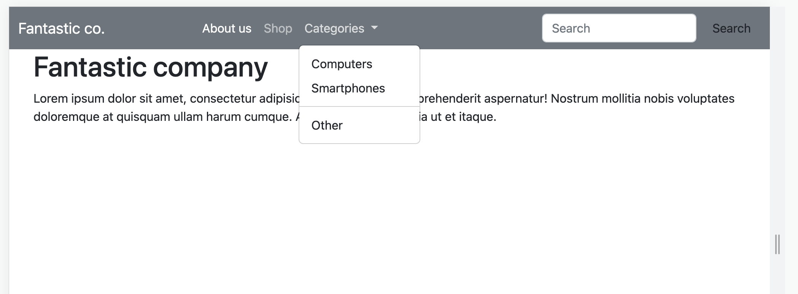
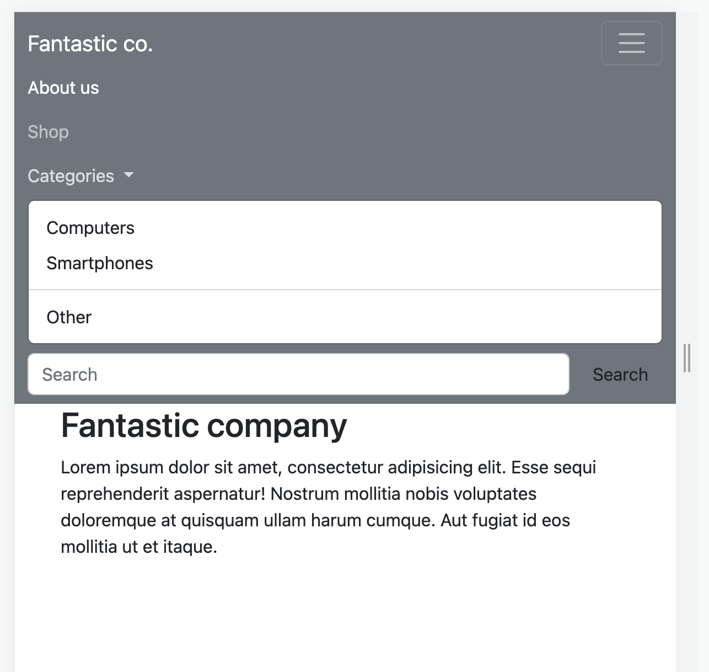

# 📘 Bootstrap navbars

We overlopen samen de documentatie:

[https://getbootstrap.com/docs/5.2/components/navbar/](https://getbootstrap.com/docs/5.2/components/navbar/)

## 💪 Bootstrap navbar (oefening)

Maak met HTML en bootstrap een pagina met de onderstaande navbar.

De navbar volgt deze criteria:

 - de navbar klapt open vanaf large viewport.
 - de navbar is licht op donker
 - de achtergrondkleur is bg-secondary
 - het item ‘Categories’ is een dropdown (opengeklapt in de screenshots)

Extra-small tot en met medium:

Large en groter:

