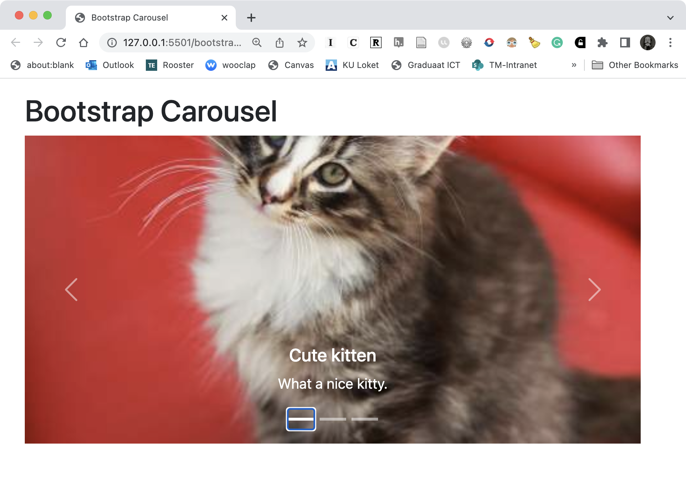
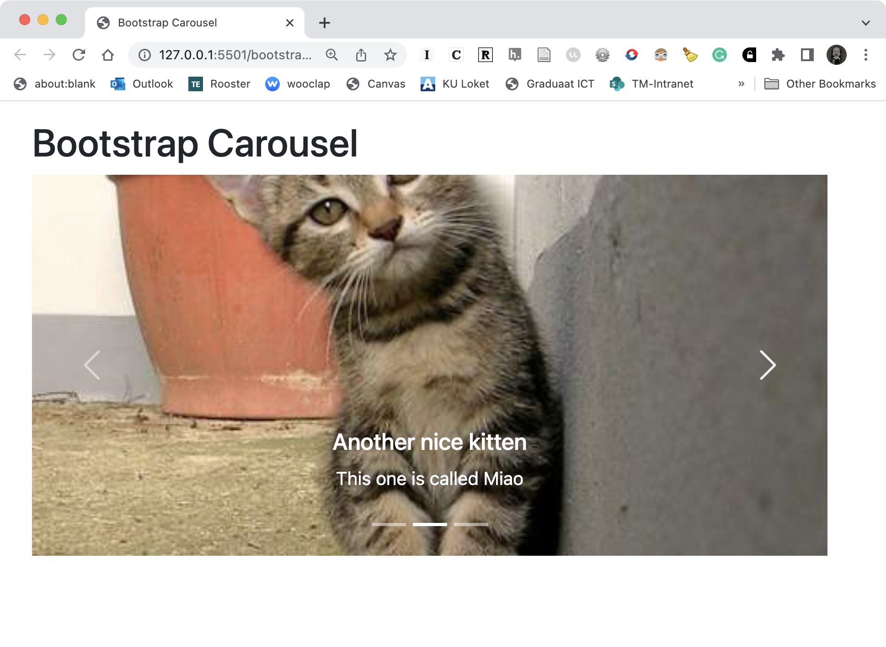
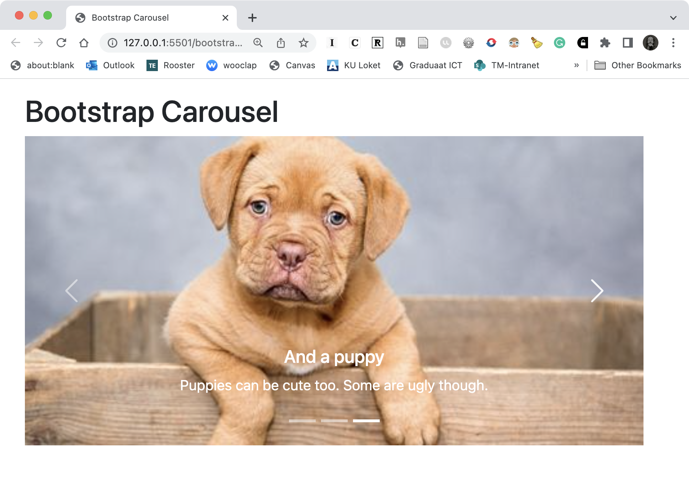

# 📘 Bootstrap carousel

We overlopen samen de documentatie:

[https://getbootstrap.com/docs/5.2/components/carousel/](https://getbootstrap.com/docs/5.2/components/carousel/)

## 💪 Bootstrap carousel (oefening)

Maak met HTML en Bootstrap een pagina met een fotocarousel.

De Carousel zit in een container die steeds de volle breedte inneemt.

Er zijn drie slides met knoppen, indicators en captions.

Voor de foto’s kan je de volgende sources gebruiken:

 - [https://placekitten.com/500/240](https://placekitten.com/500/240)
 - [https://placekitten.com/480/240](https://placekitten.com/480/240)
 - [https://place-puppy.com/480x240](https://place-puppy.com/480x240)

Het resultaatis ongeveer als volgt (je kittens kunnen anders zijn):

